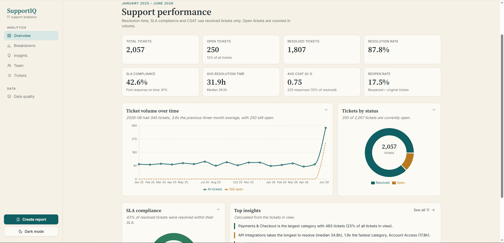
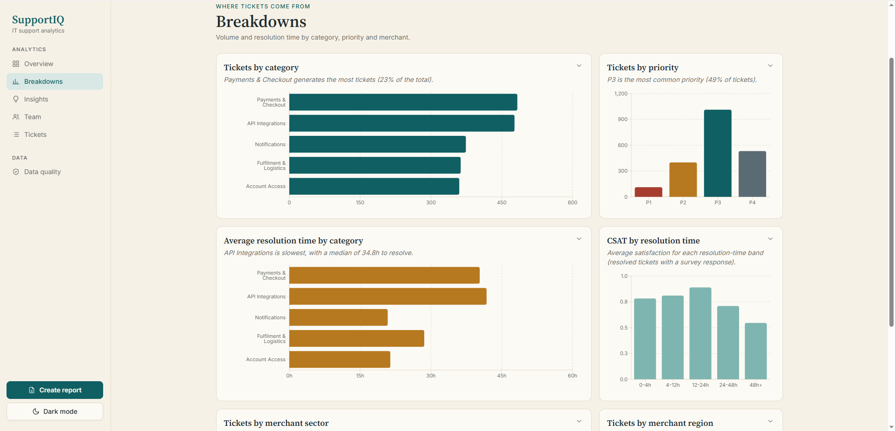
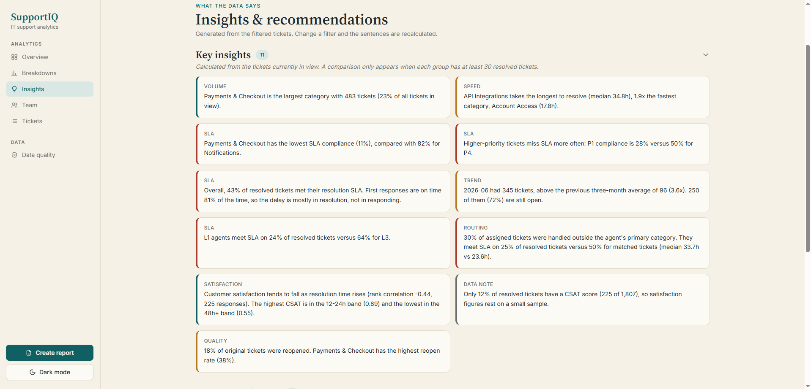
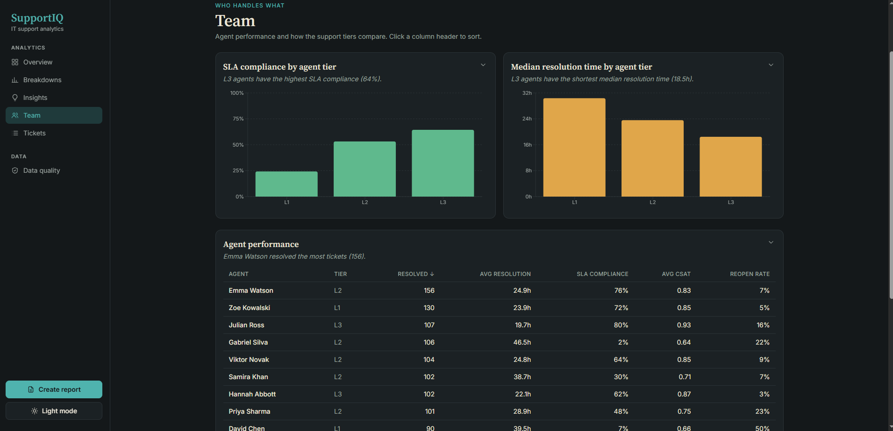
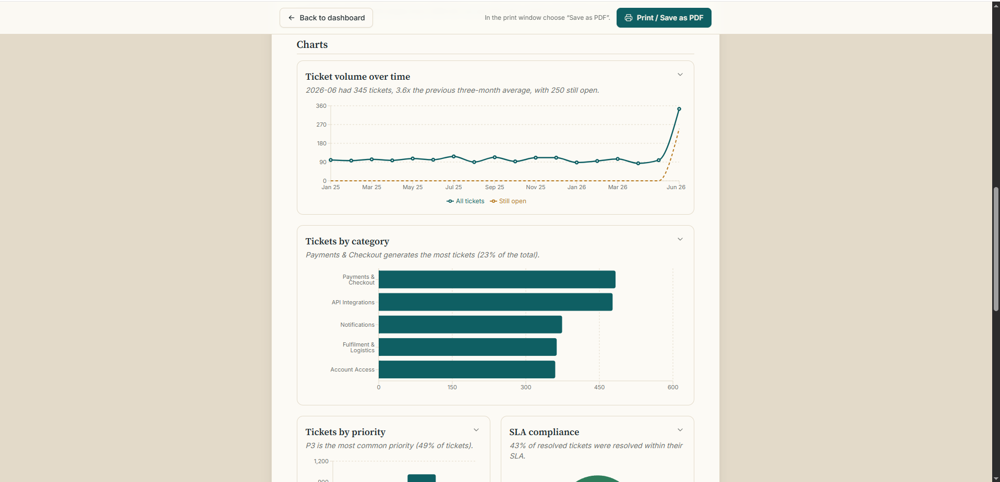

# SupportIQ

**IT support analytics dashboard.** SupportIQ turns raw support-ticket CSVs into an interactive dashboard: KPIs, SLA compliance, CSAT, agent and tier performance, and plain-English insights that are generated from the data and recalculated whenever you change a filter.

**Live demo:** https://supportiq-six.vercel.app/



---

## Contents

- [Features](#features)
- [Screenshots](#screenshots)
- [Tech stack](#tech-stack)
- [How it works](#how-it-works)
- [Dataset](#dataset)
- [Metric definitions](#metric-definitions)
- [Getting started](#getting-started)
- [Configuration](#configuration)
- [API reference](#api-reference)
- [Project structure](#project-structure)
- [Testing](#testing)
- [Deployment](#deployment)

---

## Features

- **Overview**: eight KPI cards (total, open and resolved tickets, resolution rate, SLA compliance, average resolution time, CSAT, reopen rate), monthly ticket volume with a "still open" line, ticket status and SLA donuts, and a Top insights preview.
- **Breakdowns**: tickets and resolution time by category, priority, merchant sector, region and tier, plus CSAT by resolution-time band.
- **Insights & recommendations**: sentences built from the filtered data (largest category, slowest category, SLA gaps by priority and tier, routing mismatches, volume spikes, CSAT vs resolution time, reopen rates). A comparison only appears when each group has enough resolved tickets (minimum 30), so small samples are not over-interpreted.
- **Team**: SLA compliance and median resolution time by agent tier (L1/L2/L3) and a sortable agent performance table.
- **Tickets**: server-side search, sorting and pagination over every ticket that matches the filters, with **CSV export** of the full filtered set.
- **Global filters**: date range, category, priority, status, agent, merchant sector, region and tier. Filters are shared across pages, shown as removable chips, and drive every KPI, chart, insight and table.
- **Report**: a print-friendly "Create report" page (Print / Save as PDF) that reflects the active filters.
- **Data quality**: shows the cleaning report with raw vs clean row counts, missing values and a full change log. Nothing is modified silently.
- **Upload data** (optional): validate (dry run) and replace the three CSV files from the browser. Disabled by default.
- **Light and dark themes**, responsive layout with a mobile top bar.

## Screenshots

| Breakdowns | Insights |
|---|---|
|  |  |

| Team (dark mode) | Printable report |
|---|---|
|  |  |

## Tech stack

| Layer | Technology |
|---|---|
| Frontend | React 18, TypeScript, Vite, Tailwind CSS, React Router, Recharts, Axios |
| Backend | Python 3.12, FastAPI, Uvicorn, SQLAlchemy 2, Pandas, NumPy, Pydantic |
| Database | PostgreSQL 16 |
| Tooling | Docker Compose, Nginx (serves the built frontend), pytest, Vitest |
| Hosting | Frontend on Vercel (SPA rewrite in `frontend/vercel.json`) |

## How it works

```
CSV files ──► clean() ──► PostgreSQL ──► SQL (filter + join) ──► Pandas (metrics) ──► JSON API ──► React
 data/        validate     3 tables       WHERE built from        KPIs, groups,        FastAPI       charts,
              + log                       whitelisted filters     insights, captions                 tables
```

1. **Clean.** `clean()` validates required columns, trims text, coerces numbers and dates, removes duplicates, checks priorities (P1-P4), CSAT range (0-1) and foreign keys, and adds derived columns (`status`, `created_month`). Every change goes into a change log that powers the Data quality page.
2. **Load.** Cleaned data replaces the database contents in a single transaction, so a failed load leaves existing data untouched.
3. **Filter in SQL, calculate in Pandas.** PostgreSQL does the joins and filtering using bound parameters and whitelisted column names. Pandas computes every metric from the filtered frame.
4. **One payload per page.** `/api/dashboard` returns the KPIs, every chart dataset and a caption sentence per chart, so the numbers on the page always agree with each other.
5. **Bootstrap on start.** In Docker the API container loads the CSVs on the first start only. Later restarts keep existing data (including anything you uploaded) unless `RELOAD_DATA=true`.

## Dataset

The CSV files come from the open **ITSM ticket dataset**: https://github.com/drapertoby/itsm-ticket-dataset

| File | Rows | Contents |
|---|---|---|
| `agents.csv` | 20 | agent id and name, tier (L1/L2/L3), primary category, shift region, efficiency multiplier |
| `merchants.csv` | 112 | merchant id and name, sector, tier (Foundation/Advanced), region |
| `tickets.csv` | 2,057 | category, sub-category, priority, timestamps, assigned agent, SLA breach flags, reopen flags, CSAT |

Tickets were created between **2 Jan 2025 and 30 Jun 2026**. 1,807 are resolved and 250 are open. The 250 open tickets have no agent, first response, close time or resolution time yet, which is expected and kept as-is. Only 225 resolved tickets have a CSAT response, so satisfaction figures rest on a small sample, and the dashboard says so.

## Metric definitions

| Metric | Definition |
|---|---|
| Resolved ticket | Has a `closed_at` value (`status = Resolved`); otherwise `Open` |
| Resolution rate | Resolved ÷ total tickets |
| SLA compliance | Share of **resolved** tickets with `resolution_breached = false` |
| First response on time | Share of tickets with a first response where `response_breached = false` |
| Avg / median resolution time | Over resolved tickets only |
| CSAT | `csat_score` on a 0-1 scale; tickets without a survey response are excluded from averages |
| Reopen rate | Tickets flagged `is_reopened` ÷ original tickets (`is_reopen_child = false`) |
| Category mismatch | Share of assigned tickets handled outside the agent's primary category |

Resolution time, SLA compliance and CSAT use resolved tickets only. Open tickets count towards volume.

## Getting started

### Option A: Docker (recommended)

Requires Docker and Docker Compose.

```bash
# 1. create a .env file in the project root (see Configuration below)

# 2. put agents.csv, merchants.csv and tickets.csv in ./data  (already included)

# 3. build and run everything
docker compose up --build
```

| Service | URL |
|---|---|
| Frontend | http://localhost:5173 |
| API | http://localhost:8000 |
| Interactive API docs | http://localhost:8000/docs |

On first start the API container waits for PostgreSQL, cleans the CSVs and loads them. Later starts skip loading.

### Option B: Run locally without Docker for the app

Requires Python 3.12+, Node 20+ and Docker (for the database only).

```bash
# database
docker compose up -d db

# backend
python -m venv .venv
source .venv/bin/activate            # Windows: .venv\Scripts\activate
pip install -r backend/requirements.txt

python scripts/clean_data.py         # writes data/clean/* and the quality report
python scripts/load_data.py          # loads the clean CSVs into PostgreSQL

cd backend
uvicorn app.main:app --reload --port 8000

# frontend (new terminal)
cd frontend
npm install
npm run dev                          # http://localhost:5173
```

### Handy scripts

| Script | What it does |
|---|---|
| `scripts/clean_data.py` | Cleans the raw CSVs, writes `data/clean/` and prints the data quality report |
| `scripts/load_data.py` | Drops and reloads the three tables from `data/clean/` in one transaction (safe to re-run) |
| `scripts/preview_analytics.py` | Prints KPIs, breakdowns, insights and captions straight from the CSVs, with no database needed |

## Configuration

Settings live in a `.env` file in the project root (it is git-ignored, so never commit it). The Vite frontend reads `VITE_API_URL` from the same file.

```env
POSTGRES_USER=supportiq
POSTGRES_PASSWORD=change_me
POSTGRES_DB=supportiq

# address of the API as seen from the browser
VITE_API_URL=http://localhost:8000

# set to true to enable the Upload data page
ALLOW_UPLOAD=false
```

Optional variables:

| Variable | Default | Purpose |
|---|---|---|
| `POSTGRES_HOST` / `POSTGRES_PORT` | `localhost` / `5432` | Database location (Docker Compose sets the host to `db`) |
| `POSTGRES_SSLMODE` | unset | Set to `require` for cloud databases such as Neon or Supabase |
| `DB_PORT` | `5432` | Host port mapped to the database container |
| `CORS_ORIGINS` | `http://localhost:5173` | Comma-separated list of allowed frontend origins |
| `ALLOW_UPLOAD` | `false` | Enables `POST /api/upload`. Leave off on public deployments because there is no login |
| `MAX_UPLOAD_MB` | `10` | Per-file upload limit |
| `RELOAD_DATA` | `false` | Re-clean and reload the CSVs on container start even if data exists |
| `DATA_DIR` | `./data` | Folder holding the CSV files |
| `DATA_QUALITY_PATH` | `data/clean/data_quality_report.json` | Where the quality report is written and read |
| `PORT` | `8000` | API port inside the container |

## API reference

All endpoints are under `/api`. Filter parameters are shared by the dashboard, insights, agents, tickets and export endpoints. Repeat a parameter for multiple values, for example `?category=Notifications&category=Account%20Access`.

| Method | Endpoint | Description |
|---|---|---|
| GET | `/api/health` | Health check (runs `SELECT 1`) |
| GET | `/api/filters` | Values for the filter dropdowns and the available date range |
| GET | `/api/dashboard` | KPIs, all chart datasets and one caption per chart |
| GET | `/api/insights` | Generated insights and recommendations |
| GET | `/api/agents` | Agent performance table |
| GET | `/api/tickets` | One page of tickets. Extra params: `search`, `sort_by`, `sort_dir`, `page`, `page_size` (max 100) |
| GET | `/api/export/tickets.csv` | Filtered tickets as a CSV download |
| GET | `/api/data-quality` | Data quality report |
| GET | `/api/upload/status` | Whether uploads are enabled and the size limit |
| POST | `/api/upload?dry_run=true` | Upload `agents`, `merchants`, `tickets` CSVs. `dry_run=true` validates only, `false` replaces the data |

**Filters:** `date_from`, `date_to` (YYYY-MM-DD), `category`, `priority`, `status`, `agent_id`, `merchant_sector`, `merchant_region`, `merchant_tier`.

## Project structure

```
supportiq/
├── backend/
│   ├── app/
│   │   ├── main.py                 # FastAPI app + CORS
│   │   ├── api/                    # routes.py, deps.py (shared filter parsing)
│   │   ├── analytics/              # metrics.py, insights.py, repository.py, frame.py, export.py
│   │   ├── data_pipeline/          # cleaning.py, loader.py, bootstrap.py, quality report
│   │   └── database/               # models.py, queries.py, session.py
│   ├── tests/                      # pytest suite
│   ├── Dockerfile
│   └── requirements.txt
├── frontend/
│   ├── src/
│   │   ├── pages/                  # Overview, Breakdowns, InsightsPage, Team, Tickets, DataQuality, Upload, Report
│   │   ├── components/             # Layout, FilterBar, MultiSelect, KpiCard, ChartCard, TicketTable, AgentTable, ...
│   │   ├── charts/                 # Recharts building blocks and colour palette
│   │   ├── context/                # AppState (filters + dashboard data shared across pages)
│   │   ├── hooks/                  # useApi, useInsights, useTheme
│   │   ├── services/               # api.ts (Axios client)
│   │   ├── lib/                    # formatting and filter-description helpers
│   │   └── types/                  # shared TypeScript types
│   ├── Dockerfile, nginx.conf
│   └── vercel.json
├── data/                           # agents.csv, merchants.csv, tickets.csv (+ generated clean/)
├── scripts/                        # clean_data.py, load_data.py, preview_analytics.py
├── docs/screenshots/
└── docker-compose.yml
```

## Testing

```bash
# backend (47 tests: analytics, API, bootstrap logic, cleaning pipeline, SQL builders)
cd backend
pytest

# frontend (16 tests: formatting, filter descriptions, API query building)
cd frontend
npm test

# type-check + production build
npm run build
```

## Deployment

- **Frontend:** build with `npm run build` and host the `dist/` folder. `frontend/vercel.json` rewrites all routes to `index.html` so deep links such as `/team` survive a refresh. Set `VITE_API_URL` to the public address of your API at build time.
- **Backend:** run the Docker image (or `uvicorn app.main:app`) anywhere that can reach a PostgreSQL database. Set `CORS_ORIGINS` to your frontend URL and `POSTGRES_SSLMODE=require` for managed databases. The bootstrap step loads the CSVs on the first start.
- **Security notes:** all filter values are bound parameters and sort columns come from a whitelist. The CSV export neutralises cells starting with `=`, `+`, `-` or `@` to prevent spreadsheet formula injection. Uploads are off unless `ALLOW_UPLOAD=true`, so keep them off on a public deployment.

## Data source and credits

Ticket data: [drapertoby/itsm-ticket-dataset](https://github.com/drapertoby/itsm-ticket-dataset).
